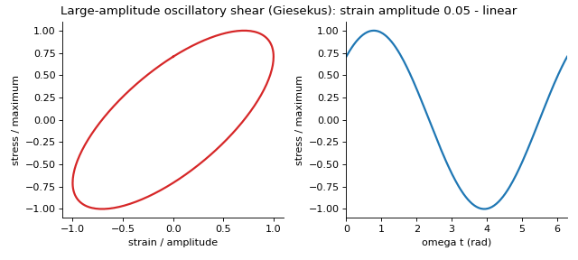
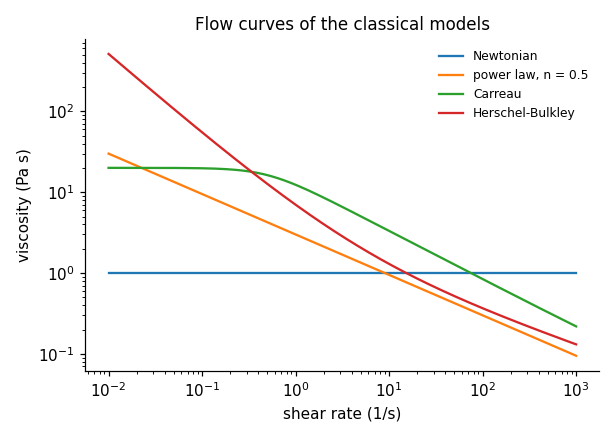
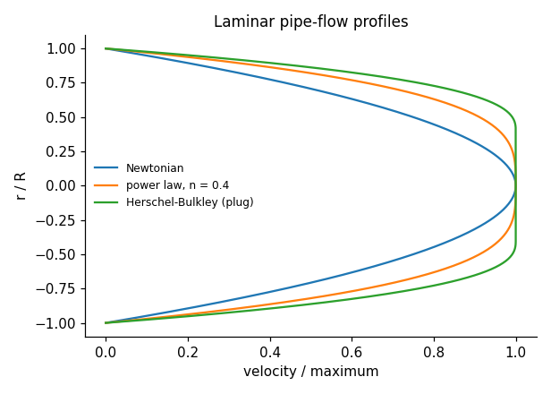
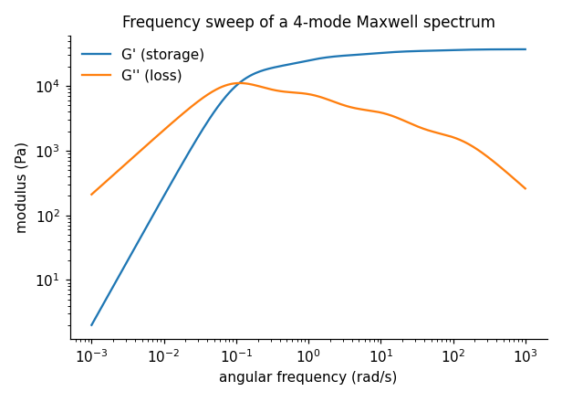
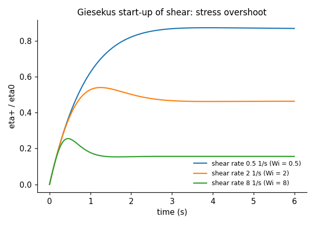
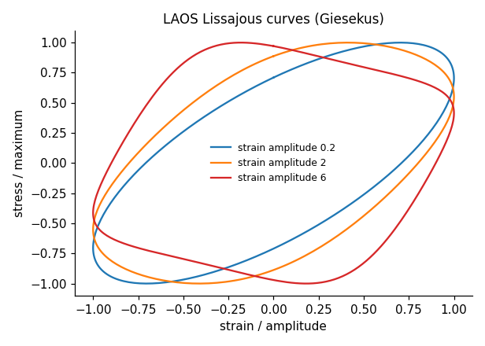
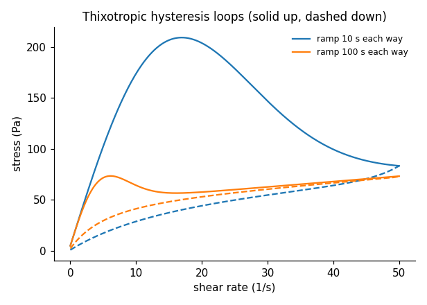

<div align="center">

# engrheo

**Rheology for engineers - readable, validated Python, with a notebook course.**

[](https://github.com/ktwyw/engrheo/actions/workflows/tests.yml)
[](docs/VALIDATION.md)
[](notebooks)
[](pyproject.toml)
[](LICENSE)
[](https://orcid.org/0000-0002-8488-9833)



</div>

`engrheo` covers the rheology engineers need in practice - from what a rheometer really measures and how
to correct it, through shear-thinning, yield-stress, thixotropic and viscoelastic behaviour, to nonlinear
and extensional flows and the design of pumping, mixing and extrusion. Every method is checked against
exact solutions or independent calculations, and an 18-notebook course with worked solutions teaches the
ideas with examples from polymers, food, drilling fluids, cosmetics and construction materials.

```python
import numpy as np
from engrheo import datasets, fitting, flows

rate, stress, *_ = np.loadtxt(datasets.path("xanthan_flow_curve.csv"), delimiter=",", skiprows=3, unpack=True)
fit = fitting.fit_flow_curve(rate, stress, "carreau")     # log-space fit with standard errors
print(fit)                                                 # eta0, eta_inf, lambda, n with 95 % intervals

# concrete pumping (Bingham: tau_y = 600 Pa, plastic viscosity 45 Pa s), 125 mm line, 30 m3/h
print(flows.pipe_hb(tau_y=600, K=45, n=1.0, R=0.0625, Q=30 / 3600))
```


## Why engrheo?

- **Measurement and analysis, not only models.** Rheometer conversions and corrections (Weissenberg-Rabinowitsch,
  Krieger, Bagley, Mooney), a Couette simulator for partially sheared gaps, the Fann 35 / API formulas,
  time-temperature superposition, spectrum fitting, LAOS analysis and capillary-thinning analysis.
- **Honest fitting.** Log-space fits with standard errors and confidence intervals, AIC model ranking, bound
  warnings - and notebooks that show when data *cannot* determine a parameter (creep without recovery,
  thixotropy without rest periods, zero-shear viscosities from capillary data).
- **Validated, not just tested.** 108 checks in [`docs/VALIDATION.md`](docs/VALIDATION.md), rerun in CI:
  exact solutions (power-law rheometry, Buckingham-Reiner and Reiner-Riwlin flows, UCM start-up and extension,
  Giesekus steady shear, Chebyshev harmonics of a stiffening spring), independent numerical integration,
  convergence rates, and simulated confidence-interval coverage.
- **Lightweight.** Only NumPy and SciPy are required.

## What's inside

| Module | Methods |
|---|---|
| `models` | Newtonian, power law, Cross, Carreau, Carreau-Yasuda, Sisko, Bingham, Herschel-Bulkley, Casson; stress, viscosity and inverse |
| `fitting` | flow-curve fitting in log space with uncertainties, automatic starting values, bound detection; AIC model comparison |
| `geometry` | cone-plate, parallel plates, Couette, capillary; Weissenberg-Rabinowitsch, Krieger, Bagley, Mooney; Couette simulation; Fann 35 / API |
| `flows` | pipe flow of power-law and Herschel-Bulkley fluids, Metzner-Reed, Ryan-Johnson, Dodge-Metzner, Hedstrom; slit flow, Metzner-Otto mixing power, Tanner die swell |
| `tts` | shift factors, master curves, WLF and Arrhenius |
| `viscoelastic` | Maxwell, Kelvin-Voigt, standard linear solid, Burgers; discrete spectra; Boltzmann superposition; relaxation-creep interconversion; regularised spectrum fitting |
| `oscillatory` | complex modulus, crossover, linear-viscoelastic limit, Winter-Chambon gel point, moduli from waveforms, Cox-Merz |
| `constitutive` | UCM/Oldroyd-B, Giesekus, PTT (multi-mode): start-up and steady shear, uniaxial extension, LAOS |
| `laos` | Fourier harmonics, Chebyshev decomposition, G'_M, G'_L, stiffening and thickening ratios |
| `thixotropy` | structural-kinetics model: step tests (exact), hysteresis loops, equilibrium flow curve |
| `suspensions` | Einstein, Batchelor, Krieger-Dougherty, Quemada; fitting the maximum packing fraction |
| `extensional` | Trouton ratio, Newtonian and elasto-capillary thinning, apparent extensional viscosity |
| `polymers` | zero-shear viscosity vs molar mass, entanglement molar mass, melt-flow-index conditions |
| `datasets` | 21 bundled course data files with sources and generating models |

## Learn: the course

Eighteen executed notebooks, each built around engineering problems, with learning objectives, an "Inside the
algorithm" section and exercises (including an "Implement it yourself" task); every exercise has a worked
solution in [`solutions/`](solutions). They open in Google Colab and install `engrheo` automatically.

| # | Notebook | Level | Engineering cases |
|---|---|---|---|
| 00 | [Python for rheology data](notebooks/00_python_for_rheology_data.ipynb) | introductory | reading a rheometer export, log scales, local slopes |
| 01 | [What rheology measures](notebooks/01_what_rheology_measures.ipynb) | introductory | process shear rates; Deborah and Weissenberg numbers |
| 02 | [Rheometers and their pitfalls](notebooks/02_rheometers_and_pitfalls.ipynb) | introductory-intermediate | polymer melt capillary (Bagley, Rabinowitsch), toothpaste wall slip, instrument limits |
| 03 | [Shear-thinning fluids](notebooks/03_shear_thinning_fluids.ipynb) | introductory | xanthan-thickened drink: model selection and extrapolation |
| 04 | [Yield-stress fluids](notebooks/04_yield_stress_fluids.ipynb) | introductory-intermediate | drilling mud (API vs fits), chocolate (Casson), fresh concrete |
| 05 | [Temperature and time-temperature superposition](notebooks/05_temperature_and_tts.ipynb) | intermediate | engine oil (Arrhenius vs Vogel), polymer-melt master curve (WLF) |
| 06 | [Thixotropy](notebooks/06_thixotropy.ipynb) | intermediate | paint hysteresis loop, cement-paste step test, gel strength |
| 07 | [Linear viscoelasticity](notebooks/07_linear_viscoelasticity.ipynb) | intermediate | bread-dough creep and recovery, relaxation to creep |
| 08 | [Oscillatory rheology](notebooks/08_oscillatory_rheology.ipynb) | intermediate | melt frequency sweep, cosmetic cream amplitude sweep, food gel point, Cox-Merz |
| 09 | [Relaxation spectra](notebooks/09_relaxation_spectra.ipynb) | advanced | spectrum fitting as an ill-posed problem |
| 10 | [Nonlinear viscoelasticity](notebooks/10_nonlinear_viscoelasticity.ipynb) | advanced | polymer solution: overshoot, normal stresses, Giesekus model |
| 11 | [Large-amplitude oscillatory shear](notebooks/11_laos.ipynb) | advanced | Lissajous curves, Chebyshev analysis of a yoghurt |
| 12 | [Polymer melts and solutions](notebooks/12_polymer_melts.ipynb) | intermediate-advanced | viscosity vs molar mass, entanglement, melt flow index |
| 13 | [Suspensions and emulsions](notebooks/13_suspensions_and_emulsions.ipynb) | intermediate | maximum packing, cornstarch shear thickening |
| 14 | [Extensional rheology](notebooks/14_extensional_rheology.ipynb) | advanced | strain hardening, capillary thinning of an inkjet fluid |
| 15 | [Pipe flow of non-Newtonian fluids](notebooks/15_pipe_flow_of_non_newtonian_fluids.ipynb) | introductory-intermediate | concrete pumping, drilling-mud circulation, restart pressure |
| 16 | [Mixing and processing](notebooks/16_mixing_and_processing.ipynb) | intermediate | mixing power, sheet-die pressure, die swell |
| 17 | [From a messy rheometer file to a report](notebooks/17_rheometer_file_to_report.ipynb) | intermediate | ketchup: parsing, checks, analysis, reproducible report |

**Learning paths:** undergraduate core 00-04, 07, 08, 15 · graduate: all, emphasis 05, 09-14 ·
industry: polymers 03, 05, 08, 09, 10, 12, 16 · food and consumer 03, 04, 06, 08, 11, 13, 17 ·
oil and gas 03, 04, 06, 15 · construction and slurries 04, 06, 13, 15.

## Gallery

Every image is computed by the library; `python tools/make_images.py` regenerates them.

| | |
|:-:|:-:|
| <br>Flow curves of the classical models | <br>Pipe-flow profiles: the yield-stress plug |
| <br>G' and G'' of a four-mode Maxwell spectrum | <br>Giesekus start-up: the overshoot grows with Wi |
| <br>LAOS Lissajous curves from linear to strongly nonlinear | <br>Thixotropic hysteresis loops at two ramp rates |

## Install

```bash
pip install "engrheo @ git+https://github.com/ktwyw/engrheo"
# or, for development:
git clone https://github.com/ktwyw/engrheo && cd engrheo && pip install -e ".[dev]"
```

## Validation at a glance

| Reference | What is checked | Agreement |
|---|---|---|
| Exact power-law solutions | parallel-plate, Couette (Krieger) and capillary (Weissenberg-Rabinowitsch) corrections | ≤ 1e-8 |
| Numerical integration | Carreau-fluid rheometry (with convergence rate), Fourier integrals of G(t), flow rates from velocity profiles | < 1 % at 8 points/decade; ≤ 1e-7 |
| Classical exact solutions | Reiner-Riwlin (partially sheared gap), Buckingham-Reiner, Hagen-Poiseuille, UCM start-up and extension, Giesekus (Bird et al.), PTT | ≤ 1e-6 |
| Interconversion | creep from relaxation for Maxwell, standard linear solid and a 7-mode spectrum spanning 9 decades | ≤ 1e-5 |
| Synthetic truths | spectrum fitting (noise floor, eta0), master curves (WLF constants), gel point, LAOS harmonics, CaBER relaxation time | ≤ 0.5 % |
| scipy, simulation | curve_fit parameters and standard errors; 95 % interval coverage (2000 data sets) | ≤ 1e-5; 95.7 % |

## Citing

If `engrheo` helps your work, please cite it using [`CITATION.cff`](CITATION.cff) (GitHub shows a
"Cite this repository" button).

## Author

**Yanwei Wang** - personal open-source project.
[GitHub @ktwyw](https://github.com/ktwyw) · [ORCID 0000-0002-8488-9833](https://orcid.org/0000-0002-8488-9833) ·
wangyanwei@gmail.com

Also by the author: [engmath](https://github.com/ktwyw/engmath) (numerical methods),
[engstat](https://github.com/ktwyw/engstat) (engineering statistics) and
[fluidmech](https://github.com/ktwyw/fluidmech) (fluid mechanics).

## License

MIT - see [LICENSE](LICENSE). Contributions welcome: see [CONTRIBUTING.md](CONTRIBUTING.md).
